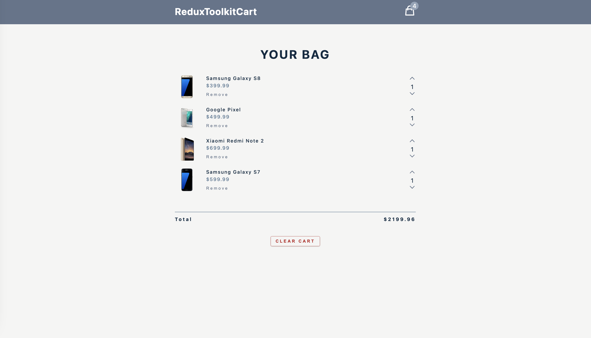

## ReduxToolkitCart

This React project implements a functional shopping cart application, utilizing various `Redux Toolkit` functionalities. It introduces `createAsyncThunk` for handling asynchronous operations, enabling smooth data fetching from an API. The main app features encompass essential functionalities such as clearing the cart, removing items, adjusting item quantities, calculating totals, and fetching data from the API. With the power of Redux Toolkit, this application provides a seamless and efficient user experience for managing the cart's state and interactions.

## Tech Stack
- `JavaScript`: The foundational programming language for creating responsive and interactive features.
- `React`: The powerful JavaScript library used to build the project: 
- `Redux Toolkit`: The core library for state management, offering features like `Immer` for state mutation, `Redux Thunk` for handling asynchronous actions, and `Reselect` for simplifying reducer functions.
- `React Redux`: The library that connects React components with the Redux store for managing application state.
- `Redux DevTools`: An extension that allows developers to inspect and debug Redux state changes in the browser.
- `React Icons`: The popular library that offers a diverse collection of icons to enhance the user interface and improve user experience in the project.

### Explore The Website
[ReduxToolkitCart on Netlify](https://toolkit-cart-app.netlify.app/)

### Preview

